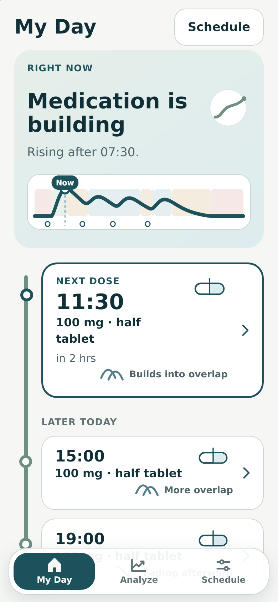
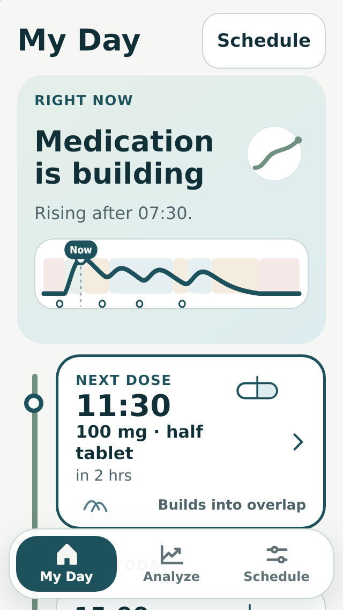
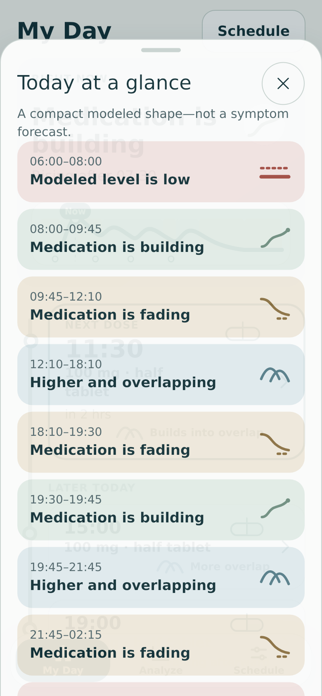
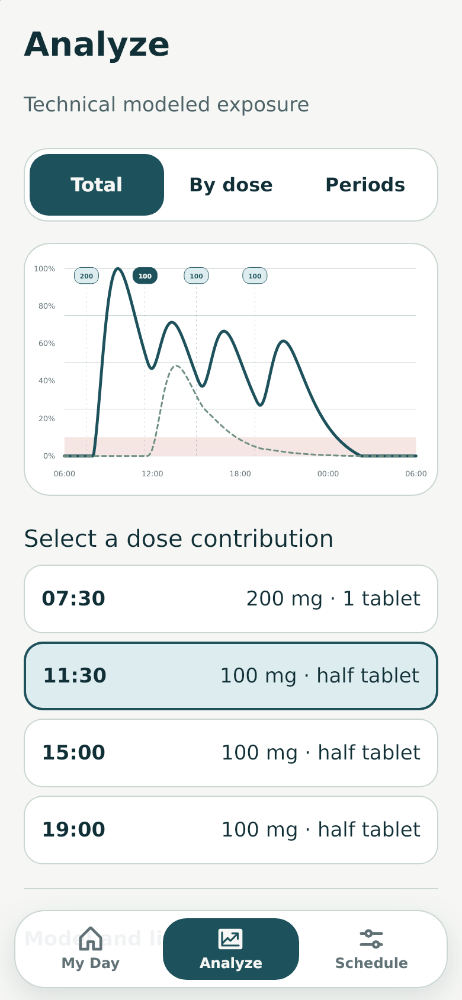
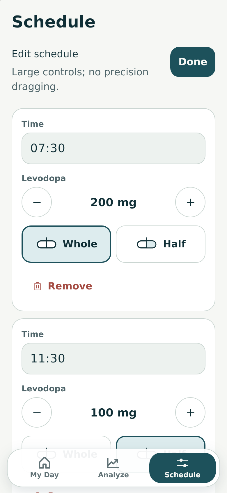
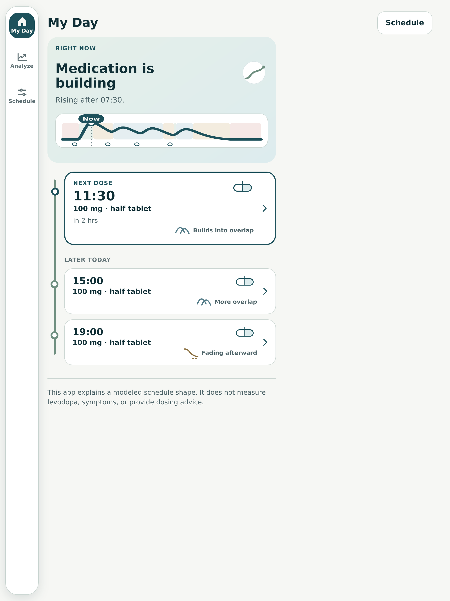

# Rendered audit: incumbent Forecast Journey

Date: 3 August 2026  
Mode: combined UX, visual-design, and screenshot-visible accessibility audit  
Status: evidence for redesign; not an implementation backlog

## Audit scope

The audited flow is My Day -> day overview -> Analyze -> Schedule. The live deployed application was walked in the cloud browser at desktop width, and the deterministic 320, 390, overview, Analyze, Schedule, and 1024 captures were retrieved from PR #2's archived verification artifact and inspected in this run.

Screenshot-visible findings do not establish full accessibility compliance. Keyboard behavior, VoiceOver speech and rotor order, physical tremor use, Dynamic Type, Mobile Safari chrome, and native sharing still require direct testing.

## Overall verdict

The product has a sound technical skeleton trapped inside an unsuccessful presentation. It is legible and operable in the narrow automated sense, but the primary phone screen is not calm, quick, or trustworthy enough for its audience. Large targets have been turned into large everything; a miniature technical model has been turned into a hero; and the fixed navigation repeatedly sits on top of content.

## Flow steps

### 1. My Day at 390px — poor

The first screen devotes its dominant area to `Medication is building` and an abstract curve. The concrete next dose is lower, taller than necessary, and enclosed by another heavy rounded boundary. The visual order says the model interpretation matters more than the medication event.

Accessibility risk visible from the screenshot: the fixed navigation covers later journey content. The problem is not target size; it is occlusion, density, and the distance required to reach the core fact.

### 2. My Day at 320px — poor

The heading and Schedule action consume a disproportionate header. The current-state panel uses most of the remaining viewport. The next-dose station is partially available before the navigation layer and loses its internal compositional logic as labels wrap and glyphs relocate.

Visible accessibility risk: magnification through scale alone leaves less information available, while the overlapping navigation reduces the usable reading window.

### 3. Today at a glance — poor

The sheet is visually a second full page, not a compact overview. Eight near-equal colored rows create another long list; the underlying medication screen ghosts through the surface; the close control and giant title consume scarce space.

The strongest visible risk is semantic: period labels such as `Medication is fading` and `Higher and overlapping` read like patient state. Color is supported by text and glyph, but those glyphs are too abstract to help recognition.

### 4. Analyze — mixed

Analyze is the strongest surface because its technical graph belongs here and the tabs plus dose list provide usable alternatives. The total curve is clear, the selected contribution is distinguishable, and the day boundary is visible.

The weaknesses are still present: oversized tabs and dose rows push model notes beneath the fixed navigation, the line-and-card language feels generic, and the connection back to My Day's plain-language labels is weak. This surface should be refined after My Day, not used as the template for it.

### 5. Schedule — mixed to poor

The direct controls, validation model, and whole/half-tablet choices are structurally good. The presentation is not: repeated giant cards create a long form with weak schedule-level comparison, navigation obscures controls, and `Large controls; no precision dragging` is internal rationale masquerading as user guidance.

Visible motor/cognitive risk: the user must traverse large distances and repeated regions to compare doses or complete the schedule. Forgiving targets do not require each dose to become an isolated poster.

### 6. Tablet/desktop — poor

The responsive transformation mainly relocates navigation and leaves a large unused field. The main content retains mobile proportions rather than using width for stronger temporal orientation, a stable contextual pane, or useful comparison. The duplicate top Schedule action remains.

## Highest-impact changes

1. Put the next dose and its timing first; make the model interpretation supportive, clearly labeled, and smaller.
2. Replace the miniature curve hero with a genuinely glanceable day orientation device or defer it behind `See today`.
3. Resolve Schedule as a contextual action unless testing proves a permanent third destination improves wayfinding.
4. Replace fixed content-covering navigation with a shell that reserves its space and transforms deliberately by device.
5. Reduce visible containers. Use time, alignment, separators, and type hierarchy before borders and cards.
6. Rewrite model-state language so every primary phrase carries its modeled/schedule-relative status without sounding like a patient observation.
7. Recompose the editor around a readable schedule list with expandable detail, preserving direct 52px actions and validation.
8. Treat tablet and desktop as comparison/orientation contexts, not white margins around a phone column.

## Evidence limits

- The mobile images are deterministic artifact captures from the exact merged implementation, retrieved and inspected during this audit; they are not a new physical-device run.
- The current deployed flow was directly walked at desktop width and matched the archived structure and content.
- The cloud browser could not be switched to a phone viewport without leaving the supported browser surface, so no claim of fresh Mobile Safari or physical-iPhone verification is made.
- Screenshot evidence cannot confirm focus order, announcement timing, touch accuracy, scroll elasticity, or assistive-technology behavior.
