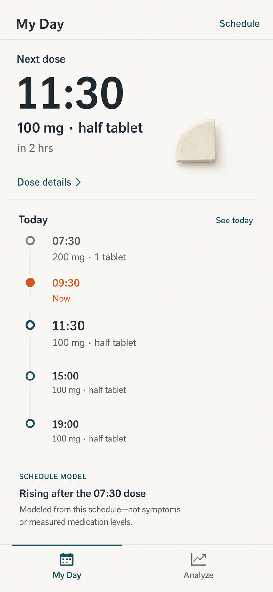
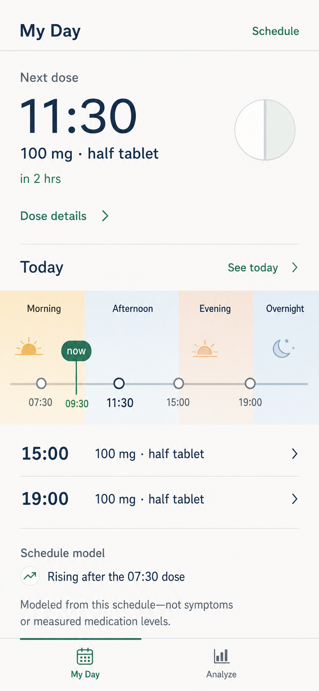
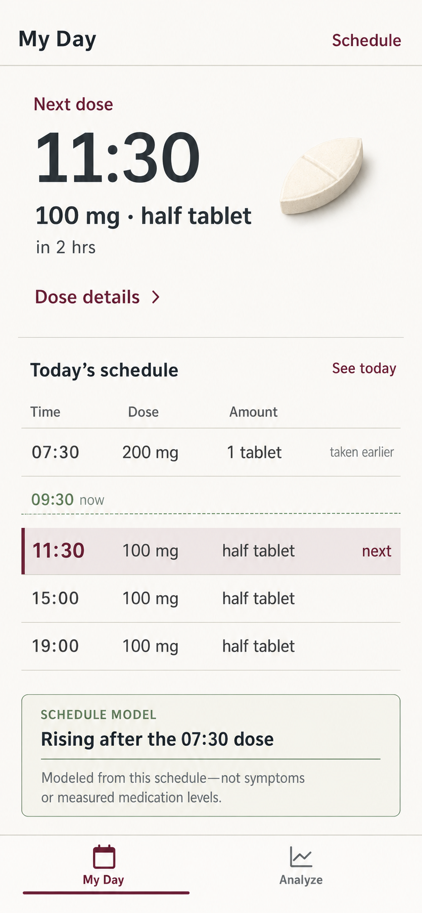

# Three-direction review

Date: 3 August 2026  
Status: awaiting user visual selection; no direction is approved

All three concepts use the same synthetic schedule, reference time, model boundary, destinations, and first-screen job. They differ in product framing and structural mechanism, not merely palette.

## Direction 1: temporal itinerary

**Structural bet:** a continuous vertical itinerary makes time and the medication day feel tangible.  
**Strength:** strongest chronological narrative and cleanest continuation from next dose to later doses.  
**Risk to refine if selected:** the full timeline is visually tall; at text enlargement, model context may need progressive disclosure to preserve the first-screen hierarchy.

## Direction 2: daylight bands

**Structural bet:** familiar parts of the day make the 06:00-06:00 window easier to grasp without a scientific curve.  
**Strength:** strongest glanceable orientation and clearest distinction between the day overview and Analyze.  
**Risk to refine if selected:** decorative daypart icons must not become a second symbol system, and the band needs an equally clear screen-reader/text alternative.

## Direction 3: medication ledger

**Structural bet:** an aligned ledger supports rapid cross-dose comparison and makes the schedule feel orderly.  
**Strength:** strongest density, comparison, and conceptual continuity with the editor.  
**Risk to refine if selected:** duplicated next-dose information must earn its space, and the visual treatment must stay warm enough not to become institutional.

## Shared QA result

- Next dose is the dominant fact in all three.
- Schedule is contextual; My Day and Analyze are the only global destinations.
- No scientific graph or modeled-state hero appears in the first viewport.
- Later dose times and the model boundary fit in the phone frame.
- Navigation reserves its own region instead of covering content.
- All visible facts are synthetic and match the default schedule.
- These are high-fidelity visual concepts, not implementation specifications and not tested interactive screens.

## Approval gate

Selection authorizes consolidation and refinement of one direction. It does not authorize implementation. After selection, the chosen direction must be resolved for dose details, See today, Schedule, Analyze, text enlargement, phone landscape, tablet, desktop, and assistive technology before Specify and implementation begin.

